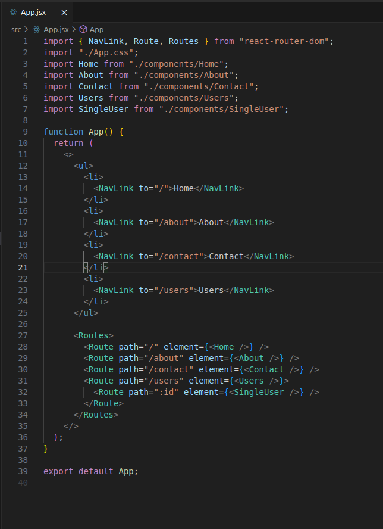
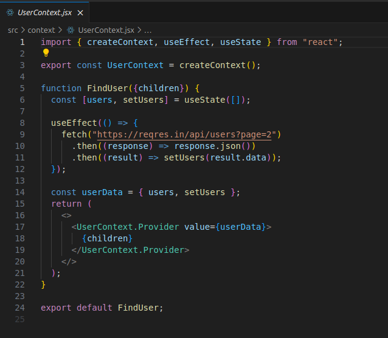
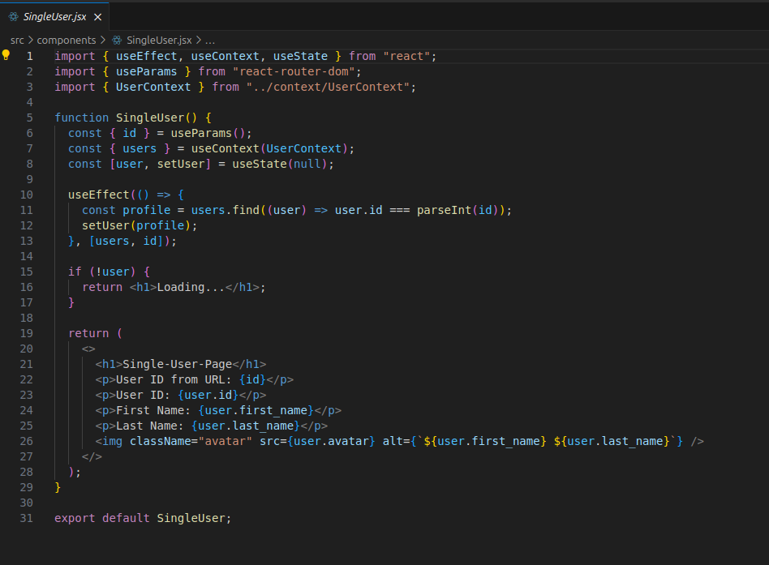
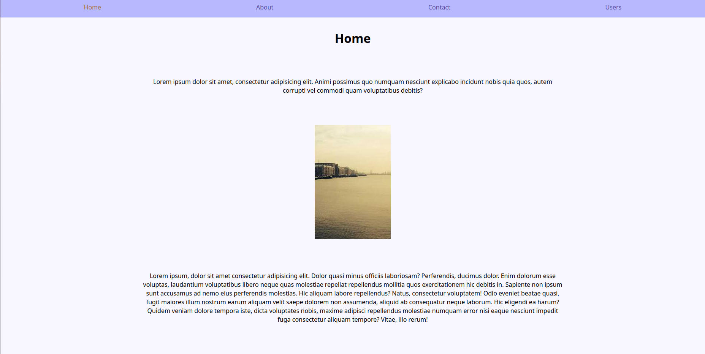
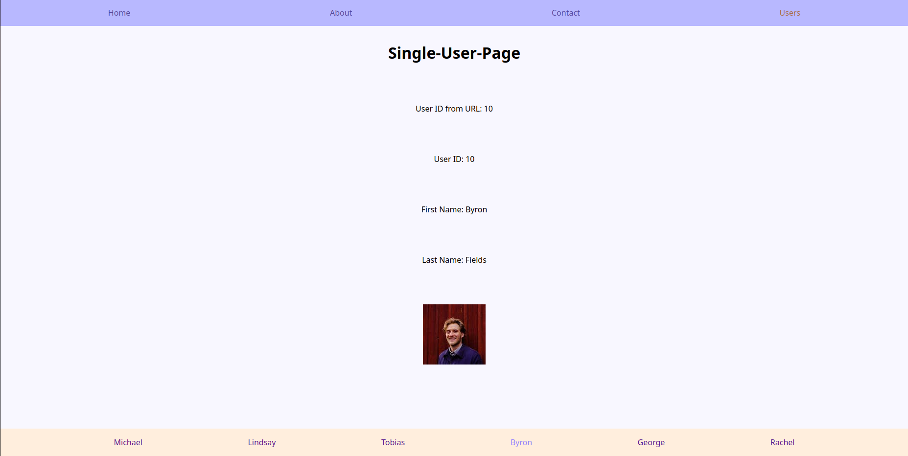

# Ex_Routing

## About The Project
The main purpose of this project is to learn the basics of React-Router. I wanted to create a generic website that navigates through the SPA using the BrowserRouter.
  
I created an agile SPA based on the following tasks: 
  

### Task 1: Basic routing
Create a React application with React Router that contains three pages:
- Home (/)
- About us (/about)
- Contact (/contact)

Use <code>BrowserRouter</code>, <code>Routes</code> and <code>Route</code> for the routing.

### Task 2: Navigation with links
Expand the application from task 1:
- Add a navigation with <code>Link</code> or <code>NavLink</code> so that the user can switch between pages.

### Task 3: Dynamic routes
Create a new page for user profiles with a dynamic URL:
- The route should be /user/:id.
- Display the id from the URL on the page.

(<a href="#readme-top">back to top</a>)

## Built With:

I wrote the project in React.js and used vite.js as a build tool. For the routing, I installed and used React-Router-Dom in the project.
  
The styling is rather in the background of this project and therefore I used vanilla CSS. 
  
In addition to the features requested in the tasks, I used a fetch for the individual users that fetches imaginary users from the API https://reqres.in/api/users. I saved these in a context so that I can use this state globally and agilely.
 

(<a href="#readme-top">back to top</a>)

### Screenshots

 
<b>App.jsx</b> - Routing in App.jsx
 
 

 
<b>UserContext.jsx</b> - Fetch inside context
 
 

 
<b>SingleUser.jsx</b> - Using context inside SingleUser.jsx
 
 
 
 
Landingpage
 
 
 
 
Single-User-Page

(<a href="#readme-top">back to top</a>)

<!-- ROADMAP -->
<!-- ## Roadmap

(<a href="#readme-top">back to top</a>)

-->

<!-- CONTACT -->
## Contact

Judith Bohmann
  
Mail: ju.bohmann@gmx.de
  
Repo-Link: <a href="https://github.com/You-Did-Bowman/2025-02-04_Ex-Routing">github.com/You-Did-Bowman/2025-02-04_Ex-Routing</a>
  

(<a href="#readme-top">back to top</a>)

